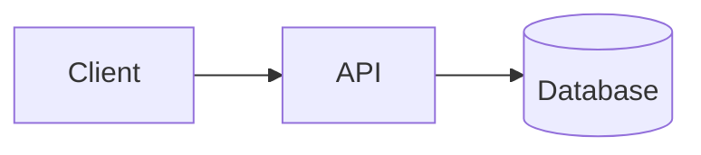

<!--
  Project README template.
  Copy this file into projects/NN-slug/README.md and replace every
  <placeholder>. Delete guidance comments once filled in.
  Every command shown in the final README must have been run successfully.
-->

# <NN> · <Project Name>

> <One-sentence summary of what the project does and for whom.>

**Difficulty:** <★★★☆☆ Advanced> · **Status:** <Planned / In progress / Complete> · **Specification:** [roadmap entry](<../../docs/roadmap/tier-N-....md#anchor>)

## Overview

<!-- The problem, who has it, and what this project demonstrates. 1–3 short paragraphs. -->

## Features

### Main features
- <Feature that works end to end>

### Advanced features
- <Feature>

### Verification status
<!-- Be explicit. Example rows below. -->

| Area | How it was verified |
| --- | --- |
| <Core API> | Integration tests against PGlite (PostgreSQL 18) |
| <Payments> | Stripe **test mode** only; webhook signatures generated with the Stripe SDK test helper |
| <AI features> | Scripted fake model in automated tests; live run on <date> with <model> (results in `evals/results/`) |

## Tech stack

| Layer | Technology | Why |
| --- | --- | --- |
| <Runtime> | <Node.js 24> | <reason> |

## Architecture

<!-- A diagram (Mermaid renders on GitHub) plus a short explanation of the main components, data flow, and key design decisions with their trade-offs. -->



### Key design decisions
- **<Decision>:** <what was chosen, the alternatives, and why>

### Folder structure
```
<tree of the main directories with one-line descriptions>
```

## Installation

**Prerequisites:** Node.js 24+, npm<, Docker (optional, for compose)>

```bash
cd projects/<NN-slug>
npm ci
cp .env.example .env
npm run dev
```

## Environment variables

| Variable | Required | Default | Description |
| --- | --- | --- | --- |
| `<PORT>` | No | `<3000>` | <HTTP port> |

## Database setup

<!-- Engine, how to create the schema (migrations), how to seed demo data, and the embedded option for local development. Include an ER diagram or a table summary. -->

```bash
npm run db:migrate
npm run db:seed
```

## API documentation

<!-- Link to the generated OpenAPI/GraphQL/AsyncAPI docs (e.g. http://localhost:3000/docs) and summarize the main endpoints or events. -->

| Method | Path | Auth | Description |
| --- | --- | --- | --- |
| `<GET>` | `</api/v1/...>` | <Bearer> | <description> |

## Testing

```bash
npm test            # unit + integration (no external services needed)
npm run test:e2e    # Playwright end-to-end (UI projects)
```

| Suite | Count | What it covers |
| --- | --- | --- |
| Unit | <n> | <scope> |
| Integration | <n> | <scope> |
| E2E | <n> | <scope> |

## Security

<!-- The threats considered and how each is addressed. Reference ARCHITECTURE.md §9 for the baseline and list project-specific measures. -->

## Performance

<!-- Optional: benchmarks with methodology, hardware, and results. Remove this section if not applicable. -->

## Deployment

<!-- Container build and run commands, compose usage, target platform notes, and current deployment status ("Not deployed", "Deployment-ready", or a live URL). -->

```bash
docker build -t <name> .
docker compose up
```

## Screenshots

<!-- Real screenshots of the running application, stored in ./docs/screenshots/. Do not use mockups. -->

| <View> | <View> |
| --- | --- |
|  |  |

## Future improvements

- <Deferred feature or known limitation, and why it was deferred>

## AI assistance

This project was built with AI assistance. See the repository's [AI_ASSISTANCE.md](../../AI_ASSISTANCE.md).
